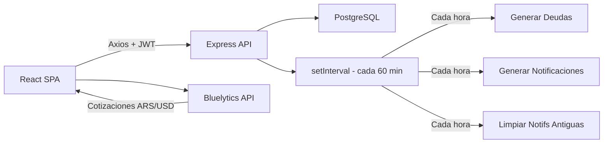
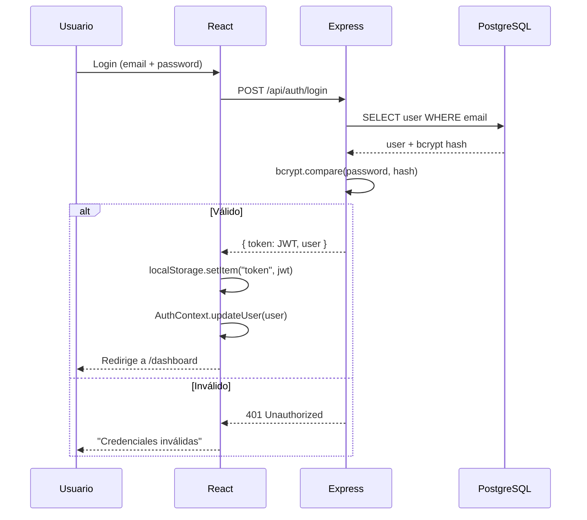
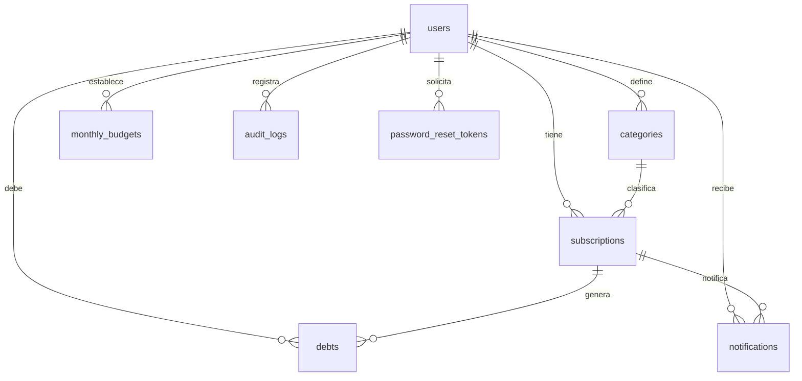

<div align="center">
  <h1>
    
    Dinerio
  </h1>
  <p><strong>Gestión Inteligente de Suscripciones</strong></p>
  <p>
    
    
    
    
    
    
    
    
    <br/>
    
  </p>
</div>

---

## 🚀 Demo

- **Frontend:** [https://proyecto-dinerio.vercel.app](https://proyecto-dinerio.vercel.app)
- **Backend API:** [https://dinerio-backend.onrender.com](https://dinerio-backend.onrender.com) (`/health` para health check)

> También puedes ejecutar el proyecto localmente siguiendo los pasos de [Instalación](#-instalación).

---

## 📋 Tabla de Contenidos

- [Demo](#-demo)
- [Capturas](#-capturas)
- [Descripción](#-descripción)
- [Roadmap](#-roadmap)
- [Calidad y Estado del Proyecto](#-calidad-y-estado-del-proyecto)
- [Tecnologías](#-tecnologías)
- [Decisiones Técnicas](#-decisiones-técnicas)
- [Características](#-características)
- [Estructura del Proyecto](#-estructura-del-proyecto)
- [Arquitectura](#-arquitectura)
- [Flujo de Autenticación](#-flujo-de-autenticación)
- [Base de Datos](#-base-de-datos)
- [Performance](#-performance)
- [Seguridad](#-seguridad)
- [Instalación](#-instalación)
- [Configuración](#-configuración)
- [Ejecución](#-ejecución)
- [API Endpoints](#-api-endpoints)
- [Despliegue](#-despliegue)
- [Limitaciones Conocidas](#️-limitaciones-conocidas)
- [Contribuir](#-contribuir)
- [Licencia](#-licencia)
- [Autor](#-autor)

---

## 🖼️ Capturas

> 🚧 Próximamente se agregarán capturas y demostraciones animadas de la aplicación.

---

## 📖 Descripción

**Dinerio** es una aplicación web que centraliza todas tus suscripciones recurrentes en un solo lugar. Calcula automáticamente el gasto mensual real con conversión ARS/USD incluyendo impuestos argentinos (IVA 21% + PAIS 30% + IIBB 2%), genera alertas de vencimiento, tracking de deudas y control presupuestario.

### Problema que resuelve

Las suscripciones están fragmentadas en múltiples servicios con distintas fechas, monedas y ciclos. Dinerio las unifica y da visibilidad total del gasto mensual.

### Stack

```
React → Axios → Express → PostgreSQL
```

### Características principales

✔ Gestión de suscripciones &nbsp; ✔ Dashboard interactivo &nbsp; ✔ Reportes financieros
✔ Presupuesto mensual &nbsp; ✔ Notificaciones automáticas &nbsp; ✔ Calendario de pagos
✔ Autenticación JWT &nbsp; ✔ Conversión ARS/USD en vivo

---

## 🚧 Roadmap

| Estado | Funcionalidad |
|--------|---------------|
| ✔ | CRUD completo de suscripciones |
| ✔ | Dashboard con KPIs y gráficos |
| ✔ | Conversión ARS/USD con impuestos |
| ✔ | Reportes financieros y exportación CSV |
| ✔ | Presupuesto mensual con alertas |
| ✔ | Calendario de pagos |
| ✔ | Notificaciones automáticas |
| ✔ | Deudas y recordatorios |
| ✔ | Auditoría de cambios |
| 🔲 | PWA (offline support) |
| 🔲 | Recordatorios por Email |
| 🔲 | Integración con Google Calendar |
| 🔲 | Exportar PDF |
| 🔲 | Modo multiusuario |

---

## ✅ Calidad y Estado del Proyecto

| Chequeo | Backend | Frontend |
|---|---|---|
| Compilación TypeScript (`tsc --noEmit`) | ✅ 0 errores | ✅ 0 errores |
| Build de producción | ✅ | ✅ |
| ESLint | ✅ 0 errores (20 warnings `any`) | ✅ 0 errores (161 warnings `any`) |
| Tests unitarios (Vitest) | — | ✅ 16/16 pasando |
| Requerimientos funcionales cubiertos | 19/19 (100%) | |
| Endpoints probados manualmente | 49/49 | |

> Los warnings de ESLint son usos de `any` y variables sin usar; no bloquean el build ni afectan el funcionamiento. Quedan documentados como mejora de tipado en el backlog.

---

## 🛠️ Tecnologías

### Frontend

| Tecnología | Versión | Propósito |
|------------|---------|-----------|
| React | ^18.3.1 | UI library |
| TypeScript | ^5.6.3 | Tipado estático |
| Vite | ^7.2.2 | Build tool |
| React Router DOM | 6.21.1 | SPA routing |
| Axios | ^1.6.5 | HTTP client |
| Framer Motion | ^12.42.2 | Animaciones |
| Lucide React | ^1.23.0 | Iconos |
| Tailwind CSS | ^4.1.17 | Estilos utilitarios |
| PostCSS | ^8.5.6 | Procesamiento CSS |
| Autoprefixer | ^10.4.22 | Prefijos CSS |
| Vitest | ^4.1.10 | Tests unitarios |
| ESLint | ^10.8.0 | Linter |

### Backend

| Tecnología | Versión | Propósito |
|------------|---------|-----------|
| Node.js | 20+ | Runtime |
| Express | ^4.18.2 | Framework web |
| TypeScript | ^5.3.3 | Tipado estático |
| PostgreSQL | 16 | Base de datos relacional |
| pg | ^8.11.3 | Driver PostgreSQL |
| JWT | ^9.0.2 | Autenticación stateless |
| bcryptjs | ^2.4.3 | Hashing de contraseñas |
| node-cron | ^3.0.3 | Instalada, no usada actualmente (ver nota abajo) |
| express-validator | ^7.0.1 | Validación de datos |
| cors | ^2.8.5 | CORS |
| ESLint | ^10.8.0 | Linter |

---

## 🤔 Decisiones Técnicas

| Decisión | Motivo |
|----------|--------|
| **React + Vite** | HMR ultrarrápido, build optimizado, ecosistema maduro |
| **TypeScript** | Evita errores en tiempo de compilación, mejora DX con autocompletado |
| **PostgreSQL** | Integridad referencial, consultas complejas, soporte JSONB para auditoría |
| **JWT stateless** | Sin sesiones en servidor, fácil de escalar horizontalmente |
| **Tailwind CSS** | Desarrollo rápido sin cambiar de archivo, bundle pequeño con purge |
| **Feature-Sliced Design** | Cada feature es autónoma: bajo acoplamiento, alta cohesión, fácil de escalar |
| **Framer Motion** | Animaciones declarativas con soporte de gestos y layout animations |
| **`setInterval` nativo** | Tareas programadas sin dependencia externa (no requiere Redis ni cola). `node-cron` está instalado pero no se usa todavía — migrar a un scheduler con persistencia de estado ante reinicios queda como mejora futura |

---

## ✨ Características

### Gestión de Suscripciones
CRUD completo con ciclos semanal, mensual, trimestral y anual. Filtros por estado/categoría, búsqueda y ordenamiento.

### Dashboard
KPIs de gasto mensual, evolución con gráfico de líneas, distribución por categorías (dona interactiva), pagos próximos con alertas de urgencia.

### Presupuesto
Configuración de límite por mes/año con umbral de alerta (1-100%). Barra de progreso, proyección de gasto y gasto diario disponible. Al crear una suscripción sin presupuesto definido advierte al usuario.

### Deudas
Generación automática desde suscripciones vencidas. Creación manual, pago, posposición (+7 días) y resumen con total adeudado.

### Calendario
Vista mensual con eventos de pago, navegación por teclado, leyenda de colores y selector de mes.

### Reportes
Reporte financiero por mes/año/rango, KPIs, evolución, desglose por categorías, comparación entre períodos y exportación CSV.

### Conversión ARS/USD
Cotizaciones en vivo desde Bluelytics API (fallback DolarAPI). Cálculo de dólar tarjeta (oficial × 1.53). Actualización cada 15 min.

### Notificaciones
Recordatorio de pago (3 días antes), alerta de presupuesto y confirmación de creación. Centro con filtros y limpieza automática (>7 días).

### Autenticación y Seguridad
JWT con expiración de 7 días, bcrypt, rutas protegidas, interceptor Axios con auto-logout en 401, auditoría de cambios.

---

## 📁 Estructura del Proyecto

```
dinerio/
├── backend/                          # API REST (Express + TypeScript)
│   ├── src/
│   │   ├── config/                   # DB pool, JWT
│   │   ├── controllers/              # Lógica de endpoints
│   │   ├── jobs/                     # Tareas programadas (cada hora)
│   │   ├── middleware/               # Auth, CORS, error handler, audit
│   │   ├── models/                   # Consultas SQL
│   │   ├── routes/                   # Definición de rutas
│   │   ├── services/                 # Debt generator, notifications
│   │   └── server.ts                 # Punto de entrada
│   ├── db/                           # schema.sql, seedData.sql
│   ├── Dockerfile
│   └── package.json
│
├── frontend/                         # SPA (React + TypeScript + Vite)
│   ├── src/
│   │   ├── app/                      # Routing, providers, protected routes
│   │   ├── features/                 # Módulos funcionales (12 features)
│   │   │   ├── auth/                 # Login, registro
│   │   │   ├── audit/               # Auditoría
│   │   │   ├── budget/             # Presupuesto
│   │   │   ├── calendar/             # Calendario de pagos
│   │   │   ├── categories/           # CRUD categorías
│   │   │   ├── dashboard/            # Dashboard principal
│   │   │   ├── debts/                # Deudas
│   │   │   ├── home/                 # Landing page
│   │   │   ├── notifications/        # Centro de notificaciones
│   │   │   ├── profile/              # Perfil de usuario
│   │   │   ├── reports/              # Reportes financieros
│   │   │   └── subscriptions/        # Gestión de suscripciones
│   │   ├── shared/                   # UI components, hooks, utils, types
│   │   ├── styles/                   # CSS por feature
│   │   └── widgets/                  # Header, Sidebar, Layout
│   ├── public/
│   │   └── icons/                    # Logo, favicon, SVGs
│   └── package.json
│
├── start.ps1
└── README.md
```

Cada **feature** es un módulo autónomo: `components/`, `hooks/`, `pages/`, `service/`, `types.ts`, `index.ts`. Esto permite **alta cohesión** y **bajo acoplamiento** —agregar o modificar una feature no afecta al resto.

---

## 🏗️ Arquitectura



### Capas del Backend

```
routes/  →  controllers/  →  services/  →  models/  →  PostgreSQL
   ↓            ↓               ↓            ↓
Validación   Lógica HTTP   Lógica negocio    SQL
```

### FSD (Feature-Sliced Design)

```
src/
├── app/           → Configuración global (providers, router)
├── features/      → Módulos funcionales independientes
├── shared/        → Código reutilizable entre features
├── styles/        → Sistema de diseño CSS
└── widgets/       → Componentes de layout
```

¿Por qué FSD? Porque cada feature contiene todo lo que necesita (componentes, hooks, servicios) y se comunica con otras solo a través de `shared/`. Esto permite escalar el proyecto sin romper funcionalidad existente.

---

## 🔐 Flujo de Autenticación



### Protección de Rutas

```
Solicitud → Axios Interceptor → ¿Token? → Sí → Adjunta Bearer → Express → auth middleware → Controller
                                       → No → Redirige a /login
               
¿401? → Axios interceptor → Elimina token → Redirige a /login
```

---

## 🗄️ Base de Datos



| Tabla | Descripción | Columnas clave |
|-------|-------------|----------------|
| `users` | Usuarios | email, password (bcrypt) |
| `categories` | Categorías | name, color, icon, user_id (null = default) |
| `subscriptions` | Suscripciones | name, amount, currency, billing_cycle, next_billing_date, status |
| `monthly_budgets` | Presupuesto por mes | user_id, year, month, budget_amount, alert_threshold |
| `debts` | Deudas | amount, due_date, status (pending/paid) |
| `notifications` | Notificaciones | type, title, message, is_read |
| `audit_logs` | Auditoría | action, entity_type, details (JSONB) |
| `password_reset_tokens` | Reset tokens | token, expires_at |

---

## ⚡ Performance

| Técnica | Implementación |
|---------|---------------|
| Lazy Loading | `React.lazy()` en rutas del frontend |
| Code Splitting | Vite divide bundles automáticamente |
| Memoización | `useMemo` / `useCallback` en componentes pesados |
| Debounce | Búsqueda de suscripciones con debounce |
| Axios Interceptors | Token caching, 401 auto-logout |
| Render optimizado | Framer Motion `layoutId` para animaciones eficientes |
| Carga diferida | Datos de evolución mensual se cargan después del render inicial |

---

## 🛡️ Seguridad

| Medida | Detalle |
|--------|---------|
| **JWT Authentication** | Tokens con expiración de 7 días, verificados en cada request |
| **bcrypt** | Contraseñas hasheadas con salt rounds |
| **Validación backend** | `express-validator` en todos los endpoints |
| **Middleware de autenticación** | Protege todas las rutas privadas |
| **CORS** | Solo permite orígenes configurados (`FRONTEND_URL`) |
| **Auditoría** | Registro de CREATE, UPDATE, DELETE con IP y detalles |
| **SQL Injection** | Todas las consultas usan parámetros con `pg` (prepared statements) |
| **XSS** | React escapa automáticamente el output |

---

## 📋 Requisitos Previos

- **Node.js** v20+
- **PostgreSQL** 16+
- **npm**

---

## 🔧 Instalación

```bash
# 1. Clonar
git clone https://github.com/tu-usuario/dinerio.git
cd dinerio

# 2. Instalar dependencias
cd backend && npm install
cd ../frontend && npm install
cd ..

# 3. Base de datos
psql -h localhost -U postgres -c "CREATE DATABASE Dinerio_db;"
psql -h localhost -U postgres -d Dinerio_db -f backend/db/schema.sql

# 4. (Opcional) Datos de demostración
psql -h localhost -U postgres -d Dinerio_db -f backend/db/seedData.sql

# 5. Variables de entorno
cp backend/.env.example backend/.env
# Editar backend/.env con tu contraseña real de PostgreSQL y un JWT_SECRET propio
```

> ⚠️ **Nunca commitees `backend/.env`** con valores reales — usá siempre `backend/.env.example` como plantilla. El `.gitignore` ya lo excluye.

---

## ⚙️ Configuración

`backend/.env` (usar `backend/.env.example` como base):

```env
DB_USER=postgres
DB_PASSWORD=tu_contraseña
DB_HOST=localhost
DB_PORT=5432
DB_NAME=Dinerio_db
JWT_SECRET=genera_un_secreto_largo_y_aleatorio_aqui
JWT_EXPIRES_IN=7d
PORT=3000
FRONTEND_URL=http://localhost:5173
```

Para generar un `JWT_SECRET` fuerte:

```bash
openssl rand -hex 32
```

Para el frontend en producción, crear `frontend/.env`:

```env
VITE_API_URL=https://dinerio-backend.onrender.com/api
```

Si no se define, el frontend usa `http://localhost:3000/api` por defecto (ver `frontend/src/shared/services/api.ts`).

### Variables de Entorno

| Variable | Requerida | Default | Descripción |
|----------|-----------|---------|-------------|
| `DB_HOST` | Sí | `localhost` | Host PostgreSQL |
| `DB_PORT` | Sí | `5432` | Puerto PostgreSQL |
| `DB_NAME` | Sí | `Dinerio_db` | Nombre BD |
| `DB_USER` | Sí | `postgres` | Usuario BD |
| `DB_PASSWORD` | Sí | `""` | Contraseña BD |
| `JWT_SECRET` | Sí | — | Secreto JWT |
| `JWT_EXPIRES_IN` | No | `7d` | Expiración token |
| `PORT` | No | `3000` | Puerto Express |
| `NODE_ENV` | No | `development` | Entorno |
| `FRONTEND_URL` | No | `http://localhost:5173` | Origen CORS |

---

## 🚀 Ejecución

### Desarrollo

```bash
# Backend (hot-reload)
cd backend && npm run dev      # http://localhost:3000

# Frontend (HMR)
cd frontend && npm run dev     # http://localhost:5173
```

### Producción

```bash
cd backend && npm run build && npm start
cd frontend && npm run build && npm run preview
```

### Script rápido (Windows)

```powershell
.\start.ps1    # Instala dependencias si faltan y arranca el backend en modo dev
```

Requiere que ya exista `backend/.env` (copiado desde `backend/.env.example`); si no existe, el script avisa y se detiene en vez de generar una configuración inválida.

---

## 🧪 Desarrollo

```bash
# Frontend
cd frontend
npm run dev          # Dev server http://localhost:5173
npm run lint         # ESLint (0 errores esperados)
npm test             # Tests unitarios (Vitest)
npm run test:watch   # Tests en modo watch
npm run typecheck    # TypeScript check (0 errores esperados)

# Backend
cd backend
npm run dev          # Dev server http://localhost:3000 (hot-reload)
npm run lint         # ESLint (0 errores esperados)
npm run typecheck    # TypeScript check (0 errores esperados)
```

---

## 🌐 API Endpoints

### Salud

| Método | Endpoint | Auth | Descripción |
|--------|----------|------|-------------|
| GET | `/health` | — | Health check |

### Autenticación (`/api/auth`)

| Método | Endpoint | Auth | Descripción |
|--------|----------|------|-------------|
| POST | `/api/auth/register` | — | Registro |
| POST | `/api/auth/login` | — | Login |
| POST | `/api/auth/password-reset` | — | Reset contraseña |
| GET | `/api/auth/check-availability` | — | Verificar email disponible |
| GET | `/api/auth/profile` | Sí | Perfil |
| PUT | `/api/auth/budget` | Sí | Actualizar presupuesto |

### Usuarios (`/api/users`)

| Método | Endpoint | Auth | Descripción |
|--------|----------|------|-------------|
| GET | `/api/users/profile` | Sí | Perfil del usuario |
| PUT | `/api/users/profile` | Sí | Actualizar perfil |
| PUT | `/api/users/settings` | Sí | Actualizar ajustes |
| PUT | `/api/users/password` | Sí | Cambiar contraseña |
| PUT | `/api/users/budget` | Sí | Actualizar presupuesto |

### Suscripciones (`/api/subscriptions`)

| Método | Endpoint | Auth | Descripción |
|--------|----------|------|-------------|
| GET | `/api/subscriptions` | Sí | Listar (filtro status) |
| GET | `/api/subscriptions/stats/summary` | Sí | Estadísticas |
| GET | `/api/subscriptions/dashboard/stats` | Sí | Stats dashboard |
| POST | `/api/subscriptions/:id/pay` | Sí | Marcar suscripción como pago |
| GET | `/api/subscriptions/:id` | Sí | Obtener una |
| POST | `/api/subscriptions` | Sí | Crear |
| PUT | `/api/subscriptions/:id` | Sí | Actualizar |
| DELETE | `/api/subscriptions/:id` | Sí | Eliminar |

### Categorías (`/api/categories`)

| Método | Endpoint | Auth | Descripción |
|--------|----------|------|-------------|
| GET | `/api/categories` | Sí | Listar |
| POST | `/api/categories` | Sí | Crear |
| PUT | `/api/categories/:id` | Sí | Actualizar |
| DELETE | `/api/categories/:id` | Sí | Eliminar |

### Notificaciones (`/api/notifications`)

| Método | Endpoint | Auth | Descripción |
|--------|----------|------|-------------|
| GET | `/api/notifications` | Sí | Listar |
| GET | `/api/notifications/recent` | Sí | Recientes |
| GET | `/api/notifications/unread/count` | Sí | No leídas |
| POST | `/api/notifications` | Sí | Crear |
| PUT | `/api/notifications/:id/read` | Sí | Marcar leída |
| PUT | `/api/notifications/read-all` | Sí | Marcar todas |
| DELETE | `/api/notifications/:id` | Sí | Eliminar |
| POST | `/api/notifications/test-generate` | Sí | Generar test |

### Calendario (`/api/calendar`)

| Método | Endpoint | Auth | Descripción |
|--------|----------|------|-------------|
| GET | `/api/calendar/events` | Sí | Eventos (mes/año) |
| GET | `/api/calendar/upcoming` | Sí | Próximos pagos |

### Deudas (`/api/debts`)

| Método | Endpoint | Auth | Descripción |
|--------|----------|------|-------------|
| GET | `/api/debts` | Sí | Listar |
| GET | `/api/debts/summary` | Sí | Resumen |
| POST | `/api/debts` | Sí | Crear manual |
| PUT | `/api/debts/:id/pay` | Sí | Pagar |
| PUT | `/api/debts/:id/postpone` | Sí | Posponer |
| DELETE | `/api/debts/:id` | Sí | Eliminar |

### Presupuesto (`/api/budgets`)

| Método | Endpoint | Auth | Descripción |
|--------|----------|------|-------------|
| GET | `/api/budgets/:year/:month` | Sí | Obtener presupuesto del mes |
| PUT | `/api/budgets/:year/:month` | Sí | Crear o actualizar presupuesto |
| DELETE | `/api/budgets/:year/:month` | Sí | Eliminar presupuesto del mes |

### Reportes (`/api/reports`)

| Método | Endpoint | Auth | Descripción |
|--------|----------|------|-------------|
| GET | `/api/reports/export/csv` | Sí | Exportar CSV |
| GET | `/api/reports/financial` | Sí | Reporte financiero |
| GET | `/api/reports/monthly-evolution` | Sí | Evolución mensual |

### Auditoría (`/api/audit`)

| Método | Endpoint | Auth | Descripción |
|--------|----------|------|-------------|
| GET | `/api/audit` | Sí | Listar logs |
| GET | `/api/audit/entity/:entityType/:entityId` | Sí | Por entidad |

### Archivos (`/api/upload`)

| Método | Endpoint | Auth | Descripción |
|--------|----------|------|-------------|
| POST | `/api/upload` | Sí | Subir archivo (placeholder) |

---

## 📦 Despliegue

### Producción actual

La aplicación está desplegada con un esquema desacoplado:

| Componente | Servicio | URL |
|------------|----------|-----|
| Backend | Render | https://dinerio-backend.onrender.com |
| Frontend | Vercel | https://proyecto-dinerio.vercel.app |
| Base de datos | Supabase | — |

> En Vercel se define `VITE_API_URL=https://dinerio-backend.onrender.com/api` como variable de entorno. Las variables del backend se configuran en el dashboard de Render (ver [Configuración](#-configuración)).

### Opción 1: Cloud (alternativa)

| Componente | Servicio |
|------------|----------|
| Backend | Render o Railway |
| Frontend | Vercel, Netlify o Cloudflare Pages |
| Base de datos | AWS RDS, Render PostgreSQL o Supabase |

### Opción 2: Docker

```bash
cd backend
docker build -t dinerio-backend .
docker run -p 3000:3000 --env-file .env dinerio-backend
```

> Solo hay Dockerfile para el backend. El frontend requiere build estático.

---

## ⚠️ Limitaciones Conocidas

Documentadas de forma explícita para ser transparente sobre el alcance actual:

- No hay pasarela de pagos real: Dinerio es un gestor de seguimiento de gastos, no procesa cobros.
- El JWT se guarda en `localStorage` (no en cookie `httpOnly`), lo que aumenta la exposición ante XSS. Migrar a cookies `httpOnly` queda como mejora futura.
- Las tareas programadas usan `setInterval` dentro del propio proceso: si el servidor se reinicia, el ciclo se interrumpe hasta el próximo arranque (no hay scheduler externo con persistencia de estado).
- La lógica de conversión ARS/USD vive tanto en frontend como en backend, sin un endpoint central único de cotización.
- `/api/upload` simula la URL del archivo; no persiste en un storage real (S3 o similar).
- No hay tests automatizados de integración ni de componentes React — solo tests unitarios de funciones puras.

---

## 🤝 Contribuir

1. Fork del repositorio
2. Rama: `git checkout -b feature/nueva-funcionalidad`
3. Commit: `git commit -m 'feat: agrega nueva funcionalidad'`
4. Push: `git push origin feature/nueva-funcionalidad`
5. Pull Request

### Convenciones

- TypeScript estricto, evitar `any`
- UI/textos en español, código/variables en inglés
- CSS en archivos separados por feature (`src/styles/`)
- Commits semánticos: `feat:`, `fix:`, `refactor:`, `chore:`

---

## 📄 Licencia

MIT.

---

## 👤 Autor

**[Guillermo Peralta]** — [GitHub](https://github.com/gperalta149-stack) · [LinkedIn](#) · [Email](#)

Proyecto desarrollado como trabajo práctico final, con foco en arquitectura full-stack, buenas prácticas de seguridad y un caso de uso real del contexto argentino (múltiples tipos de cambio ARS/USD).

---

<div align="center">
  <p>Hecho con ❤️ para gestionar suscripciones de forma inteligente</p>
</div>